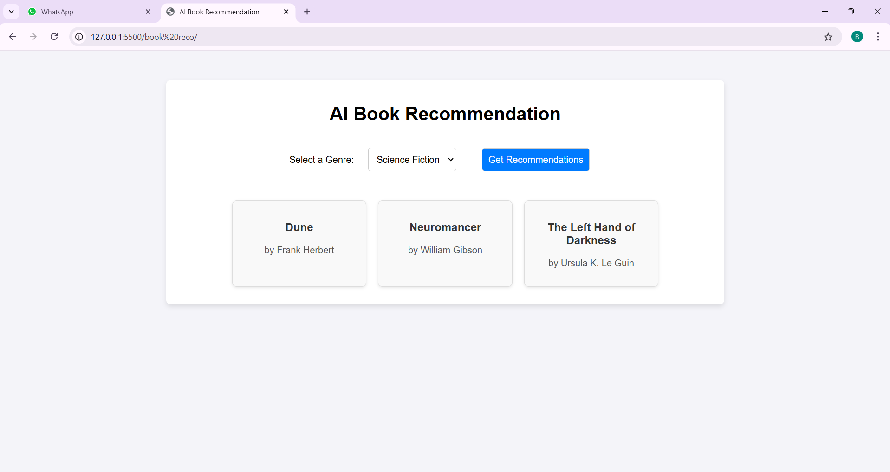

<h1>
  AI Driven Book Recomendation Website
</h1>
<h2>
  Summary
</h2>

  An AI-driven book recommendation website uses artificial intelligence algorithms to suggest books tailored to individual preferences and reading habits. The platform typically analyzes user inputs, such as genres, authors, or specific themes, and leverages machine learning models to recommend relevant books. It may also incorporate natural language processing (NLP) to understand and interpret user reviews, allowing it to fine-tune recommendations based on sentiment or specific content preferences. Additionally, the system can learn from past user interactions, adjusting suggestions over time to improve accuracy. Some websites also integrate social features, enabling users to share and rate books, further enhancing the AI's ability to recommend based on community input. The overall goal of these platforms is to create a personalized, efficient way for users to discover books they are likely to enjoy, based on data-driven insights rather than generic lists.

